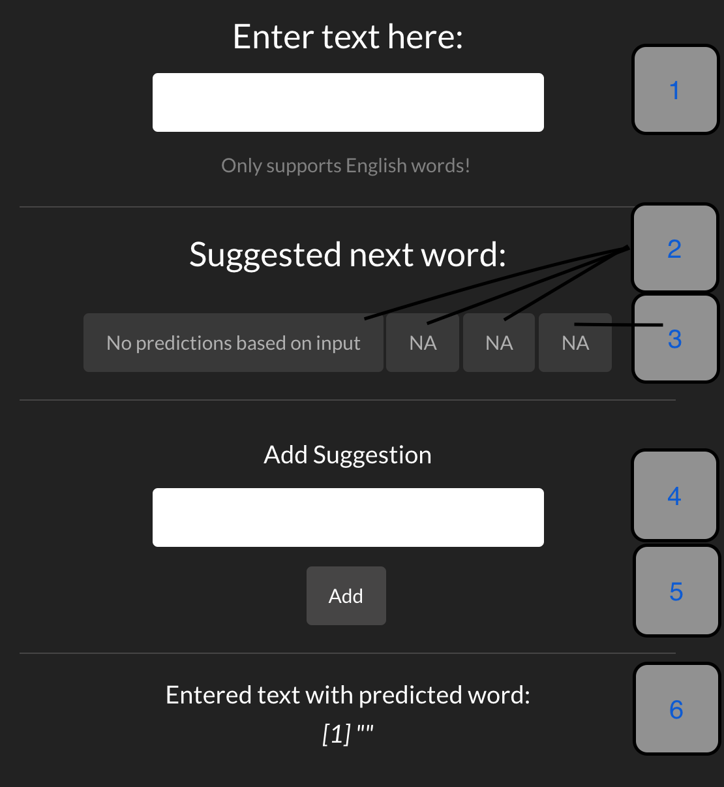

---
output:
  html_document:
    keep_md: true
---
## Coursera Data Science Capstone 

#### Objective: The main objective of this capstone project was to use the provided HC Corpora dataset and develop an application that takes as input a phrase (multiple words) in a text box input and outputs a prediction of the next word.

***
### Application Usage 

  As a majority of SwiftKey product consumers are mobile users, simplicity and efficiency were two key  factors taken in consideration while developing the application. To start using the application, users must input a word or phrase into the first text input field (**Box 1**). Once a valid phrase has been entered, the application will automatically search for suggestions. If there are any available suggestions, the buttons linked to **Box 2** will be activated and will display the top three (if available) suggestions. If the user wants to use one of the displayed suggestions, they simply click on the button and it will be added to the end of their input. As soon as the suggestion is added, the application will instantaneously search for news suggestions based on the updated input. The last button linked to **Box 3** will only be activated and display a suggestion when there is learned suggestion available. To add a learned suggestion, the user must input *one* word into the input field at **Box 4** and then simply press the 'Add' button. This will add the new suggestion to the end of the current input and remember it for similar phrases in the future. **Box 6** displays the final output consisting of user input and selected suggestions. 

  

  

***

## Additional Information and Documentation 

- The instructions and guidelines for this project, along with additional information, can be found at: 
  - [https://www.coursera.org/learn/data-science-project/home/welcome](https://www.coursera.org/learn/data-science-project/home/welcome)

- All data used for our predicition model came from the HC Corpus dataset. The dataset can be downloaded at:     
  - [https://d396qusza40orc.cloudfront.net/dsscapstone/dataset/Coursera-SwiftKey.zip](https://d396qusza40orc.cloudfront.net/dsscapstone/dataset/Coursera-SwiftKey.zip)

- All the code, data, and resources used in creation of the app can be found at: 
  - [https://github.com/Saifeel/Coursera-Data-Science-Capstone](https://github.com/Saifeel/Coursera-Data-Science-Capstone)

- The text prediction App is hosted at:
  - [https://saifeel.shinyapps.io/ShinyApp/](https://saifeel.shinyapps.io/ShinyApp/)
